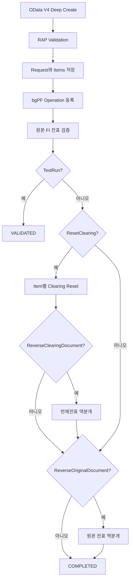

# ZFI_REV

전표의 Clearing 초기화와 reverse를 async로 진행 ( RAP OData V4(Web API) )

unmanaged RAP, Save Phase buffer, bgPF와 Factory/Proxy 적용

# 범위

- 외부 요청 ID를 이용한 중복 접수 방지
- RAP Deep Create로 원본 전표 Header와 반제전표 Items 접수
- bgPF 비동기 실행
- 선택한 반제전표별 Clearing Reset
- 선택적 반제전표 역분개
- 원본 FI 전표 역분개
- 요청·품목별 처리 상태, BAPI 메시지, 역분개 Object Key 저장
- Test Run 시 입력 및 원본 전표 존재 여부만 검증
- 완료된 요청과 품목을 건너뛰는 기본 재실행 보호

# 흐름



## OData V4 객체

| 역할 | 객체 |
|---|---|
| Header Interface View | `ZI_FI_REV_REQ` |
| Item Interface View | `ZI_FI_REV_ITM` |
| Header Projection View | `ZC_FI_REV_REQ` |
| Item Projection View | `ZC_FI_REV_ITM` |
| Behavior Pool | `ZBP_I_FI_REV_REQ` |
| Service Definition | `ZAPI_FI_REV` |
| Service Binding | `ZAPI_FI_REV_O4` |
| Header Entity Set | `ReversalRequests` |
| Item Entity Set | `ReversalClearingItems` |

## Header Parameters

| 파라미터 | 필수 | 설명 |
|---|:---:|---|
| `ExternalRequestId` | O | 외부 시스템 멱등성 키 |
| `CompanyCode` | O | 원본 전표 회사코드 |
| `FiscalYear` | O | 원본 전표 회계연도 |
| `DocumentNumber` | O | 원본 FI 전표번호 |
| `DocumentOrigin` |  | `FI` 기본값. `FI_AA`는 현재 차단 |
| `ReversalReason` | O | 역분개 사유 |
| `ReversalPostingDate` | O | 역분개 전기일 |
| `ReversalPeriod` |  | 역분개 전기기간 |
| `BusinessTransaction` |  | BAPI Business Transaction, 기본값 `RFBU` |
| `ResetClearing` |  | Items에 지정한 반제전표 초기화 |
| `ReverseClearingDocument` |  | 반제 초기화 후 반제전표도 역분개 |
| `ReverseOriginalDocument` |  | 원본 전표 역분개 |
| `TestRun` |  | 실제 변경 없이 기본 검증 |
| `Destination` |  | 향후 Remote Adapter 확장용. 현재 Local Proxy에서는 사용하지 않음 |
| `HeaderText` |  | 요청 설명 |

## Item Parameters

| 파라미터 | 필수 | 설명 |
|---|:---:|---|
| `ItemNumber` | O | 요청 내 품목번호 |
| `ClearingCompanyCode` | O | 초기화할 반제전표 회사코드 |
| `ClearingFiscalYear` | O | 반제전표 회계연도 |
| `ClearingDocument` | O | 초기화할 반제전표번호 |

`ResetClearing = true`이면 최소 한 개의 Item이 필요합니다. 하나의 원본 전표에 여러 반제전표가 연결된 경우 Items에 모두 전달합니다.

## 요청 예제

```json
{
  "ExternalRequestId": "REV-2026-000001",
  "CompanyCode": "1000",
  "FiscalYear": "2026",
  "DocumentNumber": "1900000123",
  "DocumentOrigin": "FI",
  "ReversalReason": "01",
  "ReversalPostingDate": "2026-07-30",
  "ReversalPeriod": "07",
  "BusinessTransaction": "RFBU",
  "ResetClearing": true,
  "ReverseClearingDocument": true,
  "ReverseOriginalDocument": true,
  "TestRun": false,
  "HeaderText": "Wrong customer clearing",
  "_Items": [
    {
      "ItemNumber": "000001",
      "ClearingCompanyCode": "1000",
      "ClearingFiscalYear": "2026",
      "ClearingDocument": "1400000456"
    }
  ]
}
```

## 처리 상태

| 상태 | 의미 |
|---|---|
| `ACCEPTED` | RAP 요청 저장 및 bgPF 예약 |
| `VALIDATING` | 원본 전표와 요청 검증 중 |
| `VALIDATED` | Test Run 검증 완료 |
| `RESETTING_CLEARING` | 반제 초기화 중 |
| `REVERSING_CLEARING` | 반제전표 역분개 중 |
| `REVERSING` | 원본 전표 역분개 중 |
| `COMPLETED` | 요청 또는 품목 완료 |
| `VALIDATION_FAILED` | 입력 또는 원본 전표 검증 실패 |
| `RESET_FAILED` | 반제 초기화 실패 |
| `CLEARING_REV_FAILED` | 반제전표 역분개 실패 |
| `REVERSAL_FAILED` | 전표 역분개 실패 |
| `UNSUPPORTED_ORIGIN` | 현재 Adapter가 지원하지 않는 원천 전표 |


